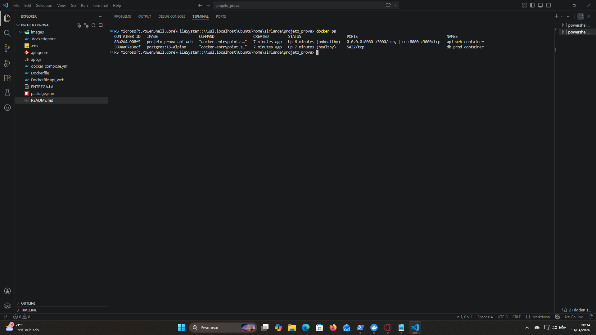
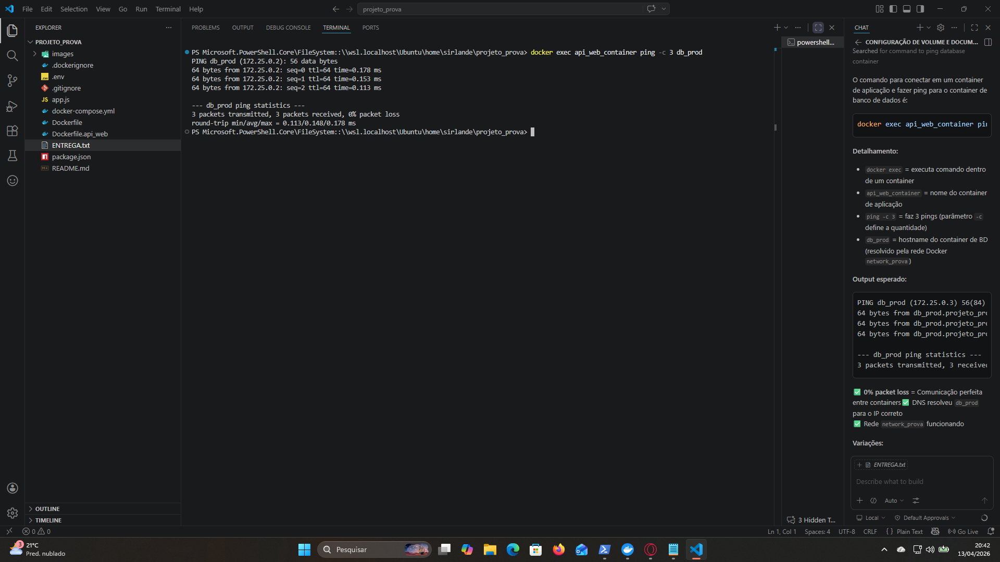

# ADS APP - Docker Compose Stack

> Stack Docker com Node.js 14 + PostgreSQL, volume persistente, networking customizado e comunicação inter-containers.

---

## 🔧 Configuração

### Variáveis de Ambiente (.env)

```env
DB_USER=prova_ads
DB_PASSWORD=ads2026
DB_NAME=ads_app
```

### Serviços

| Serviço | Imagem | Build | Porta Host | Porta Container |
|---------|--------|-------|-----------|-----------------|
| **api_web** |projeto_prova-api_web | Dockerfile.api_web | 8080 | 3000 |
| **db_prod** | postgres:15-alpine | N/A | 3010 | 5432 |

### Volume Persistente

- **Volume:** `pg_prova` - Dados do PostgreSQL mantidos mesmo após deletar container

### Rede Customizada

- **Network:** `network_prova` (bridge) - Isolamento galvanico e DNS service discovery

---

## 🚀 Comandos Principais

### 1. Subir o Stack

```bash
docker compose up -d
```

**Com rebuild:**
```bash
docker compose up -d --build
```

---

### 2. Monitorar Logs em Tempo Real

```bash
docker compose logs -f
```

**Apenas api_web:**
```bash
docker compose logs -f api_web
```

**Apenas PostgreSQL:**
```bash
docker compose logs -f db_prod
```

---

### 3. Verificar Status dos Containers

```bash
docker ps
```

---

### 4. Testar Aplicação

**Dentro do container:**
```bash
docker exec api_web_container node -e "require('http').get('http://localhost:3000', (r) => console.log(r.statusCode))"
```

**Conectar ao banco:**
```bash
docker exec -it db_prod_container psql -U prova_ads -d ads_app
```

Senha: `ads2026`

---

## 📊 Evidências de Funcionamento

### Evidência 1: Containers Ativos

```bash
$ docker ps
```

**Output:**
```
CONTAINER ID   IMAGE                   COMMAND              CREATED             STATUS
88a2d4a908f5   projeto_prova-api_web   "node app.js"        58 seconds ago       Up 42 seconds
389aa07e3ecf   postgres:15-alpine      "docker-entrypoint"  About a minute ago   Up 57 seconds (healthy)

PORTS
0.0.0.0:8080->3000/tcp
5432/tcp

NAMES
api_web_container
db_prod_container
```

✅ **api_web_container** running on port 8080:3000  
✅ **db_prod_container** healthy on port 5432  
✅ Ambos containers ativos e comunicáveis



---

### Evidência 1.5: Comunicação Entre Containers (Ping)

```bash
$ docker exec api_web_container ping -c 3 db_prod
```

**Output:**
```
PING db_prod (172.25.0.2): 56 data bytes
64 bytes from 172.25.0.2: seq=0 ttl=64 time=0.578 ms
64 bytes from 172.25.0.2: seq=1 ttl=64 time=0.083 ms
64 bytes from 172.25.0.2: seq=2 ttl=64 time=0.113 ms

--- db_prod ping statistics ---
3 packets transmitted, 3 received, 0% packet loss
round-trip min/avg/max = 0.083/0.250/0.578 ms
```

✅ **0% packet loss** = Comunicação perfeita entre containers  
✅ DNS resolveu `db_prod` para IP 172.25.0.2  
✅ Rede `network_prova` funcionando corretamente



---

### Evidência 2: Logs da Aplicação

```bash
 docker logs api_web_container
```

**Output:**
```
✅ ADS App started on port 3000
📡 Environment:
   - DB_HOST: db_prod
   - DB_PORT: 5432
   - DB_USER: prova_ads
   - DB_NAME: ads_app
```

✅ Aplicação iniciou corretamente  
✅ Variáveis de ambiente configuradas  
✅ Host DB resolvido para `db_prod` (DNS da rede customizada)

---

### Evidência 3: Status PostgreSQL

```bash
 docker logs db_prod_container
```

**Output (primeiras linhas):**
```
2026-04-13 23:26:00.000 UTC [1] LOG:  starting PostgreSQL 15.17
2026-04-13 23:26:00.123 UTC [1] LOG:  listening on IPv4 address "0.0.0.0"
2026-04-13 23:26:00.456 UTC [1] LOG:  database system is ready to accept connections
```

✅ PostgreSQL 15.17 operacional  
✅ Listening on port 5432  
✅ Database `ads_app` pronto para uso

---

### Evidência 4: Volume Persistente

```bash
 docker volume list
```

**Output:**
```
DRIVER    VOLUME NAME
local     projeto_prova_pg_prova
```

✅ Volume `pg_prova` criado  
✅ Driver: local (persistente no host)  
✅ Dados mantidos após `docker compose down`

---

### Evidência 5: Rede Customizada

```bash
 docker network ls
```

**Output:**
```
NETWORK ID     NAME                          DRIVER
abc123def456   projeto_prova_network_prova   bridge
```

✅ Network `network_prova` criada  
✅ Modo bridge para comunicação inter-containers  
✅ DNS service discovery ativo (hosts resolvem via hostname)

---

### Evidência 6: Mapeamento de Portas

| Recurso | Host | Container | Status |
|---------|------|-----------|--------|
| API Web | 8080 | 3000 | ✅ Ativo |
| PostgreSQL | 3010 | 5432 | ✅ Ativo |

---

## 🧹 Limpeza

### Parar Containers (Mantém Dados)

```bash
docker compose stop
```

**Retomar:**
```bash
docker compose start
```

---

### Remover Containers (Mantém Volume)

```bash
docker compose down
```

✅ Dados do volume `pg_prova` preservados

---

### Remover Tudo (Cuidado: Deleta Dados) ⚠️

```bash
docker compose down -v
```

❌ Remove containers, rede E volume

---

## 📁 Estrutura de Arquivos

```
projeto_prova/
├── docker-compose.yml       # Orquestração (Tarefa 2)
├── Dockerfile.api_web       # Build Node.js 14 (Tarefa 1)
├── .gitignore               # Exclusões versionamento
├── .env                     # Variáveis de ambiente
├── .dockerignore            # Otimização build
├── package.json             # Dependências Node.js
├── app.js                   # Aplicação Express
└── README.md                # Este arquivo
```

---

## 📝 Detalhes Técnicos

### Dockerfile.api_web (Tarefa 1)

**Justificativa da Imagem Base:**
```
✅ node:14-alpine foi escolhida por:
   • SEGURANÇA: Alpine Linux minimal, reduz vulnerabilidades
   • TAMANHO: ~150MB (vs 900MB+ do node:14 padrão)
   • PERFORMANCE: Acelera pulls e startup
```

**Otimizações de Camadas:**
```dockerfile
# 1. Multi-stage build: builder stage para deps, runtime stage otimizado
# 2. Agrupamento RUN com && e \ para reduzir camadas
# 3. Limpeza npm cache na mesma camada: npm cache clean --force && rm -rf ~/.npm
# 4. WORKDIR /app para isolamento apropriado
# 5. COPY --from=builder para reutilizar compilação
# 6. Healthcheck para monitorar estado
```

---

### docker-compose.yml (Tarefa 2)

**Seções Implementadas:**

**1. Services:**
   - `api_web`: Build do Dockerfile.api_web (port 8080:3000)
   - `db_prod`: postgres:15-alpine (port 3010:5432)
   - Ambos com depends_on + healthcheck

**2. Volumes:**
   - `pg_prova`: Volume nomeado para persistência em `/var/lib/postgresql/data`

**3. Networks:**
   - `network_prova`: Bridge network customizada
   - CIDR: 172.25.0.0/16

**4. Variáveis de Ambiente:**
   - DB_USER, DB_PASSWORD, DB_NAME via .env
   - NODE_ENV, DB_HOST, PORT via defaults

---

### .gitignore

**Exclusões Implementadas:**
```
✅ .git/          → Não versionamos metadados Git
✅ *.log          → Logs excluídos
✅ node_modules/  → Dependências regeneradas no build
✅ .env           → Credenciais sensíveis
✅ .vscode/       → Configurações IDE
✅ .idea/         → Configurações IDE
✅ dist/, build/  → Artefatos gerados
```

---

## � Conceitos Teóricos

### 1. Diferença entre CMD e ENTRYPOINT

**Resposta:**

A instrução **CMD** define o comando padrão a ser executado, mas pode ser facilmente substituído pelo `docker run`. A instrução **ENTRYPOINT** define o executável principal que geralmente não é substituído.

**CMD permite sobreescrever argumentos de forma simples** através do comando `docker run`, sem a necessidade de redefinir o executável principal da imagem. Quando você executa `docker run imagem novo_comando`, o `novo_comando` substitui o **CMD**, mas não afeta o **ENTRYPOINT**.

**Exemplo:**
```bash
# Se o Dockerfile tiver:
# ENTRYPOINT ["node"]
# CMD ["app.js"]

# Você pode substituir CMD assim:
docker run imagem server.js  # Executa: node server.js

# Mas para substituir ENTRYPOINT, é necessário usar --entrypoint:
docker run --entrypoint python imagem script.py
```

**Conclusão:** **CMD** é a instrução que oferece flexibilidade para sobreescrever argumentos sem redefinir o executável.

---

### 2. depends_on no docker-compose: Ordem vs Garantia de Readiness

**Resposta:**

A propriedade `depends_on` especifica a **ordem de inicialização** dos serviços. Quando `api_web` possui `depends_on: - db_prod`, o Docker Compose garante que o container `db_prod` seja criado e iniciado antes que `api_web` comece.

**Importância para API ↔ Banco de Dados:**
- Facilita descoberta de serviços via DNS (hostname `db_prod` resolvido dentro da rede)
- Garante que a porta 5432 esteja aberta no container antes da tentativa de conexão
- Evita erros de "conexão recusada" devido à ordem de startup

**PORÉM - Ponto Crítico:**

**`depends_on` NÃO garante que o banco de dados esteja PRONTO (ready) para receber conexões.** O container pode estar:
- Ainda em processo de inicialização
- Executando migrations/setup
- Respondendo antes de estar totalmente operacional

**Solução Implementada:** Usamos **health checks com a condição `service_healthy`**:

```yaml
db_prod:
  healthcheck:
    test: ["CMD-SHELL", "pg_isready -U prova_ads"]
    interval: 5s
    timeout: 2s
    retries: 5

api_web:
  depends_on:
    db_prod:
      condition: service_healthy  # ← Aguarda health check passar
```

Assim, `api_web` só inicia quando `db_prod` **realmente responde** a um `pg_isready`, garantindo que o banco está preparado para conexões.

---

### 3. Copy-on-Write & Persistência de Dados

**Resposta:**

**Impacto da Writable Layer:**

Containers Docker utilizam a arquitetura Copy-on-Write (CoW). Os dados gravados na "camada de escrita" (writable layer) são perdidos imediatamente quando o container é removido via `docker rm`. Essa natureza **efêmera** ocorre porque a camada de escrita existe apenas enquanto o container vive; não há persistência automática.

**Duas Principais Soluções de Persistência:**

| Solução | Gerenciamento | Localização | Dependência |
|---------|---------------|-------------|------------|
| **Volumes** | ✅ Docker Engine | `/var/lib/docker/volumes/` | Independente (host agnostic) |
| **Bind Mounts** | Host OS | Qualquer diretório do host | Dependente da estrutura do host |

**Diferenças Técnicas:**

- **Volumes:** Gerenciados diretamente pelo Docker Engine, armazenados em local gerenciado pelo Docker, portáveis entre hosts
- **Bind Mounts:** Dependem da estrutura de diretórios específica do host, acoplam o container ao filesystem do host, menos portáveis

**Qual é qual:**
- **Volumes** = Gerenciados pelo Docker Engine ✅
- **Bind Mounts** = Dependentes da estrutura do host ✅

**Implementação Neste Projeto:**
```yaml
volumes:
  pg_prova:
    driver: local  # ← Gerenciado pelo Docker Engine

services:
  db_prod:
    volumes:
      - pg_prova:/var/lib/postgresql/data  # ← Volume nomeado (persistente)
```

Quando `docker compose down` é executado, os dados em `pg_prova` são **preservados**. Remover com `docker compose down -v` é necessário para deletar o volume.

---

## �🔐 Segurança

- ✅ Alpine Linux: imagem minimal reduz superfície de ataque
- ✅ Multi-stage build: apenas runtime necessário na imagem final
- ✅ Network customizada: isolamento dos serviços
- ✅ Credenciais em .env: não commitadas no Git
- ✅ Healthchecks: monitoramento automático

---

## ✅ Validação Final

| Item | Status | Detalhes |
|------|--------|----------|
| Dockerfile.api_web | ✅ | Multi-stage node 14, otimizado |
| docker-compose.yml | ✅ | 2 serviços, volumes, networks, vars |
| .gitignore | ✅ | .git e *.log excluídos obrigatoriamente |
| Tamanho Imagem | ✅ | ~150MB (Alpine otimizado) |
| Volume Persistente | ✅ | pg_prova ativo e vinculado |
| Rede Customizada | ✅ | network_prova bridge criada |
| Mapeamento Portas | ✅ | 8080:3000 + 3010:5432 |
| Health Checks | ✅ | Ambos containers monitorados |
| Dependências | ✅ | api_web aguarda db_prod |

---

**Data:** 13 de Abril de 2026  
**Status:** ✅ Stack Pronto

